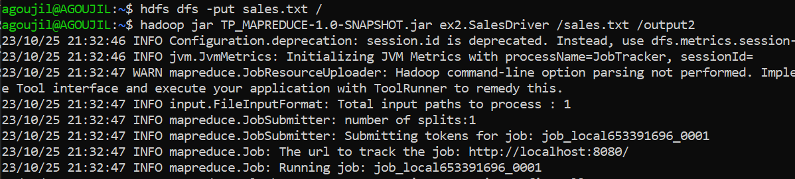

<h1>Project Overview : </h1>
- First App
  1. **Word Count MapReduce Job:**

  - **Objective:** Develop a MapReduce Job to count the occurrences of each word  in a text file (words.txt).

  - **Input Data:** The input file, words.txt, contains a list of phrases or words.

  - Use Hadoop MapReduce to determine the number of occurrences of each word or phrase in the file.

- Second App
 1. **Sales by City Job:**

    - **Objective:** Develop a Map Reduce Job to calculate the total sales by city from an input text file (sales.txt), which contains the sales of a company in various cities.

    - **Format of the sales.txt file:**
        ```
        date city product price
        ```

    - The Map Reduce code processes this data and provides total sales by city.

    - You can test this code by running the job on the Hadoop cluster.

 2. **Product Sales by City for a Given Year Job:**

    - **Objective:** Create a second Map Reduce Job to calculate the total price of product sales by city for a specific year.

    - This job uses the sales.txt file as input, filters the data based on the specified year, and then calculates the total price of product sales by city for that year.

    - You can also test this code by executing it on the Hadoop cluster.

- Third App
 1. **Web Logs Analysis Job:**

    - **Objective:** Develop a MapReduce Job to analyze web server logs. Each line in the log file contains information about HTTP requests, including the client's IP address, date, requested path, HTTP response code, etc.

    - The goal is to perform log analysis to find the total number of requests per IP address and the number of successful requests (HTTP response code 200) per IP address.

    - **Input Data:** A collection of text-format web log files, for example:
        ```
        192.168.1.1 - - [12/May/2023:15:30:45 +0000] "GET /page1 HTTP/1.1" 200 1234
        192.168.1.2 - - [12/May/2023:15:31:02 +0000] "GET /page2 HTTP/1.1" 404 567
        192.168.1.1 - - [12/May/2023:15:32:10 +0000] "GET /page1 HTTP/1.1" 200 789
        192.168.1.3 - - [12/May/2023:15:32:35 +0000] "GET /page3 HTTP/1.1" 200 987
        ```

    - Use Hadoop MapReduce to calculate the total number of requests and the number of successful requests (HTTP response code 200) per IP address.


<h3>Command to compile The Code</h3>
<strong>> javac -classpath $HADOOP_HOME/share/hadoop/common/hadoop-common-2.x.y.jar -d /path/to/output-dir /path/to/your-code/*.java</strong>
<h3>Command to upload Input Data</h3>
<strong>> hadoop fs -put /local/path/to/ventes.txt /user/yourusername/input/</strong>
<h3>Command to run the MapReduce Jobs:</h3>
<strong>> hadoop jar /path/to/your-jar-for-job1.jar input-path output-path</strong>
<h3>Command to check the Output</h3>
<strong>> hadoop fs -cat /user/yourusername/output/part-r-00000</strong>
<h3>Project Architecture</h3>
</img>


</img>


<h2><b>Test the first application<b></h2>


  - Inpute Data
</img>

  - Upload Input Data to hadoop files
</img>

  - Run the MapReduce Jobs
</img>

  - You can see all the details
</img>

  - Check the Output
</img>

<h2><b>Test the second application<b></h2>
  
  - Inpute Data
    
</img>

  - Upload Input Data to hadoop files
</img>

  - Run the MapReduce Jobs
</img>

  - Check the Output
</img>

  - Yearly Sales Per City
</img>

  - Check the Output
</img>

<h2><b>Test the third application<b></h2>
  
  - Inpute Data
</img>

  - Upload Input Data to hadoop files
</img>

  - Run the MapReduce Jobs
</img>
</img>

- Check the Output
</img>
