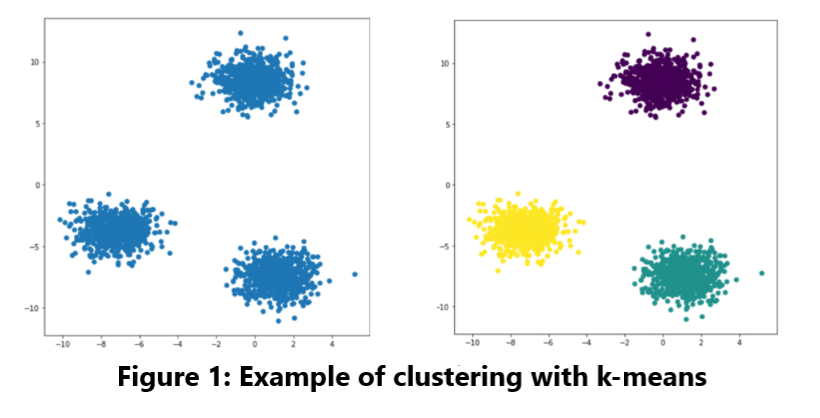
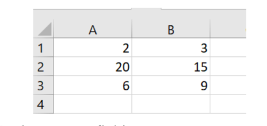
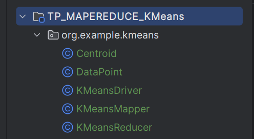
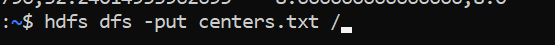
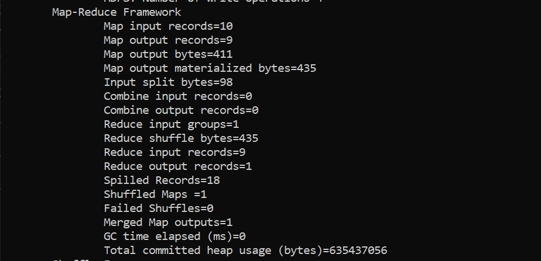
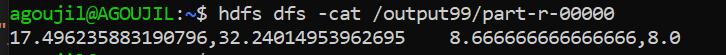

<h1> Parallel implementation of Kmeans algorithm using mapreduce </h1>

K-Means is a clustering algorithm that partitions a set of data points into k clusters (Figure 1). 
</img>
The k-means clustering algorithm is commonly used on large datasets and, due to the algorithm's characteristics,
is a good candidate for parallelization. The purpose of this exercise is to implement k-means using Hadoop MapReduce.

    - **Objective:** The purpose of this exercise is to implement k-means using Hadoop MapReduce.
    - The algorithm consists of the following steps:

    - (a)The algorithm starts by randomly selecting k centroids.

    - (b)The points are assigned to the nearest centroids, using a selected distance measure.

    - (c)The mean of the points in each cluster is calculated and considered as the new centroid.

    - (d)Steps 2 and 3 are repeated until the centroids no longer move or the maximum number of iterations has been reached. As a result, the points are finally classified into k clusters.

The first step is to cluster the points. Each point is characterized by x and y coordinates. You create a CSV file containing the points, with each point stored in a line. The file format is as follows:

</img>

You also create a file called "centers.txt" containing the values of three initial centroids. The "centers.txt" file is loaded into the distributed cache of HDFS.

The Map method receives the line containing the x and y values of the point as a value. It then finds the closest centroid to the point by calculating the distance between the point and all three centroids. The formula used to calculate the distance is as follows:

  d = √((xa − xb)^2 + (ya − yb)^2)

Where:

  xa and ya are the coordinates of point a.
  
  xb and yb are the coordinates of point b.

The Reduce operation receives the centroid value as a key and a list of points belonging to the cluster as a value. It then calculates the new centroid value, which represents the mean of the points in the cluster. The same steps are then repeated until the algorithm converges. Convergence is considered to have been reached when the values of the centroids no longer change.

<h3>Command to compile The Code</h3>
<strong>> javac -classpath $HADOOP_HOME/share/hadoop/common/hadoop-common-2.x.y.jar -d /path/to/output-dir /path/to/your-code/*.java</strong>
<h3>Command to upload Input Data</h3>
<strong>> hadoop fs -put /local/path/to/ventes.txt /user/yourusername/input/</strong>
<h3>Command to run the MapReduce Jobs:</h3>
<strong>> hadoop jar /path/to/your-jar-for-job1.jar input-path output-path</strong>
<h3>Command to check the Output</h3>
<strong>> hadoop fs -cat /user/yourusername/output/part-r-00000</strong>
<h3>Project Architecture</h3>
</img>
<h2><b>Test the first application<b></h2>
    - Inpute Data
</img>
    - Upload Input Data to hadoop files
</img>
    - Run the MapReduce Jobs
</img>
    - You can see all the details
</img>
    -Check the Output
</img>
