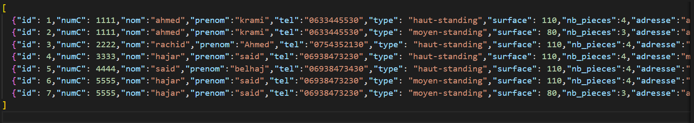
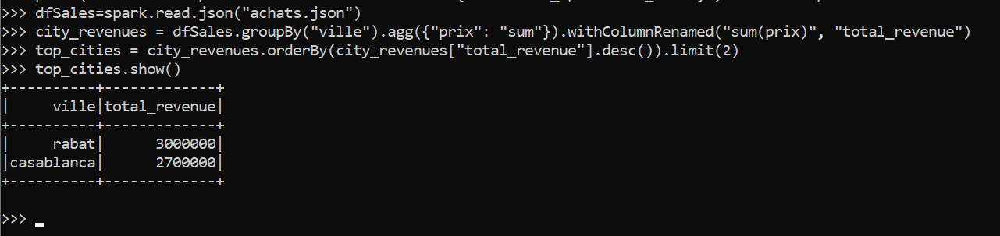
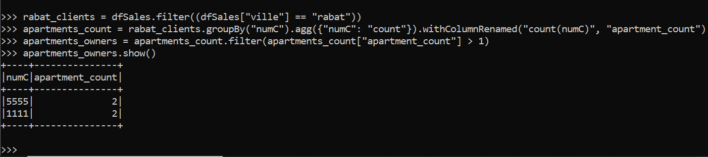
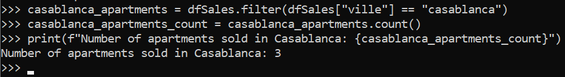

<h1> Processing Data Stored in a JSON File with PySpark. </h1>

<h2> Application  : </h2>
The company has a large JSON file containing apartment sales data for its clients.
The file includes information about the apartments purchased by each client (refer to the JSON file).

Example of of JSON file:
</img>

Tasks to be performed:

1. Display the top two cities where the company has achieved the highest sales (in terms of revenue).

</img>

2. Display the list of clients who own more than one apartment in Rabat.

</img>

3. Display the number of apartments sold in Casablanca.

</img>

